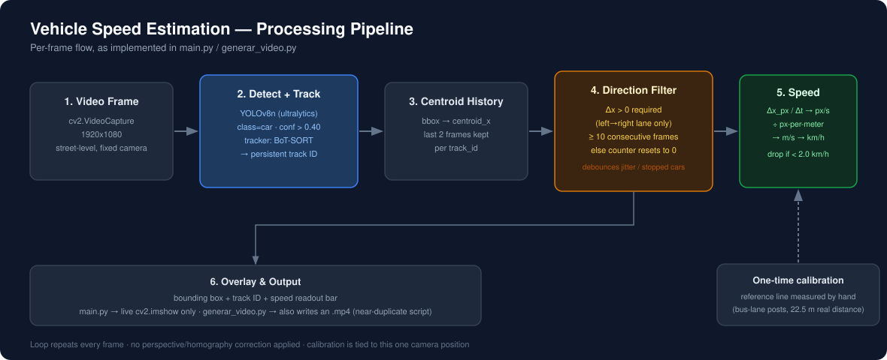
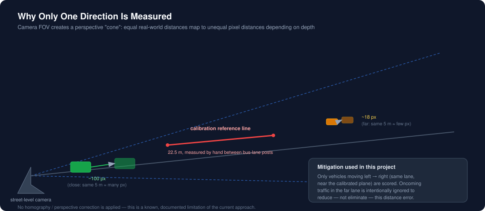

# 🚗 Vehicle Speed Estimation from Monocular Video

**YOLOv8 detection + tracking, manual metric calibration, and a direction-persistence filter to estimate real-world vehicle speed (km/h) from a single street-level camera.**


> **On the demo media:** the source videos are not stored in this repository (see [Getting Started](#getting-started)), and no output screenshots ship with the code as of writing. The two diagrams below were authored for this README from the actual pipeline logic — they are **not** screenshots of a running output. See [Adding a demo clip](#adding-a-demo-clip) if you want to generate one.

---

## Overview

This project estimates the speed of vehicles moving through a fixed camera's field of view, using **YOLOv8n** for detection and tracking and a manual pixel-to-meter calibration derived from a real, hand-measured reference distance. It was built as an alternative angle on traffic-speed monitoring to the standard Doppler-radar approach: a single camera, no specialized hardware, and — in principle — the ability to extract more than just speed (trajectory, lane discipline, traffic flow) from the same feed.

It's a small, single-purpose computer vision project, not a production system — see [Known Limitations](#known-limitations--possible-improvements) for an honest list of what it doesn't handle yet.

## How It Works



1. **Frame capture** — read from a local `.mp4` via OpenCV.
2. **Detection + tracking** — YOLOv8n (`ultralytics`), restricted to the `car` class, with a BoT-SORT tracker assigning a persistent ID to each vehicle across frames.
3. **Centroid history** — the bounding-box centroid's x-position is stored per track ID (last 2 frames only).
4. **Direction filter** — a vehicle only counts once it has moved rightward (`Δx > 0`) for **10 consecutive frames**. This debounces tracker jitter and stopped/oncoming vehicles; any reversal resets the counter.
5. **Speed calculation** — pixel displacement over elapsed frame time → px/s → divided by a calibrated `pixels-per-meter` factor → m/s → × 3.6 → km/h. Speeds below 2.0 km/h are discarded as noise.
6. **Overlay & output** — bounding box, track ID, and a bottom speed-readout bar. `main.py` only shows this live; `generar_video.py` additionally writes it to an `.mp4`.

## Calibration Methodology



The first version of this project used an elevated (bridge-mounted) camera with distances estimated from Google Maps. That approach was scrapped: at a steep downward angle, a car's apparent pixel displacement shrinks the further it travels from the camera, so speed was systematically underestimated as vehicles moved away — and no reliable perspective-correction method could be sourced to fix it.

The current version uses a street-level shot instead. The camera's field of view still produces a "cone" effect — equal real-world distances map to unequal pixel distances depending on depth — but it's less severe than the bridge angle. To calibrate, the real-world distance between two roadside bus-lane posts was **measured by hand with a tape measure** (22.5 m) and matched to their pixel separation in frame. To limit the residual cone-effect error, **only vehicles traveling in one direction** (left → right, in the near lane) are scored; oncoming traffic in the far lane is intentionally excluded rather than measured with a known-bad distance assumption.

## Configuration Reference

All values below are hardcoded constants in `main.py` / `generar_video.py`:

| Parameter | Value | Meaning |
|---|---|---|
| `MODELO_YOLO` | `yolov8n.pt` | Nano variant, chosen for real-time-ish performance over accuracy |
| `CONFIDENCE_THRESHOLD` | `0.40` | Minimum detection confidence kept |
| `MIN_TRACK_HISTORY` | `2` | Frames of centroid history used per speed sample |
| `FRAMES_REQUIRED_FOR_PERSISTENCE` | `10` | Consecutive rightward frames before a speed is trusted |
| `MIN_SPEED_KMH` | `2.0` | Below this, a vehicle is treated as stationary/noise |
| `LONGITUD_REAL_METROS` | `22.5` | Real-world length of the calibration reference line, in meters |

## Getting Started

The source videos and the `yolov8n.pt` weights are **not included** in this repository (file size / course-submission limits). `yolov8n.pt` downloads automatically on first run via `ultralytics`; you'll need to supply your own video(s) under `videos/`.

```bash
# from vision_entrega/
python -m venv venv

# Windows
venv\Scripts\activate
# macOS / Linux
source venv/bin/activate

pip install -r requerimientos.txt

# place your own footage at videos/lu_2.mp4 (or edit VIDEO_PATH in the script)
python codigo/main.py            # live preview only
python codigo/generar_video.py   # live preview + writes video_velocidad_analizado.mp4
```

> `requerimientos.txt` in this repo is a full `pip freeze` from a shared ROS 2 development environment — it drags in a few hundred unrelated packages (`rclpy`, `ament-*`, etc.). The only packages this specific project actually imports are `opencv-python`, `numpy`, and `ultralytics`.

### Adding a demo clip

Once you have a processed output from `generar_video.py`, you can turn it into a lightweight GIF for the README with `ffmpeg`:

```bash
ffmpeg -i video_velocidad_analizado.mp4 -vf "fps=10,scale=800:-1:flags=lanczos" -loop 0 assets/demo.gif
```

## Repository Structure

```
VPA-PCL-T4/
├── LICENSE
├── README.md
├── assets/
│   ├── pipeline_diagram.svg
│   └── calibration_diagram.svg
└── vision_entrega/
    ├── README.txt
    ├── requerimientos.txt
    └── codigo/
        ├── main.py            # live preview
        └── generar_video.py   # live preview + video export (near-duplicate of main.py)
```

## Known Limitations & Possible Improvements

Documented honestly, not swept under the rug:

- **No perspective/homography correction.** The single biggest source of error; the report explicitly notes an earlier attempt at this failed for lack of a reliable reference. A proper fix would be a homography transform calibrated with 4+ known ground points.
- **Calibration is manual and tied to one fixed camera position.** Moving the camera means re-measuring and re-hardcoding the reference line by hand — there's no interactive calibration tool.
- **No quantitative validation.** The accompanying report evaluates results qualitatively only; there's no ground-truth comparison (e.g., a radar gun or GPS-logged pass) to quote an actual error margin.
- **Edge-of-frame effect.** As a vehicle exits the right edge, YOLO keeps a partial detection with a lagging centroid, causing a momentary, artificial speed drop.
- **`main.py` and `generar_video.py` are ~90% duplicated code.** The only functional difference is a `cv2.VideoWriter`. This should be one script with an `--export` flag, not two files to keep in sync.
- **No CLI, no config file.** Video path and calibration points are hardcoded constants; there's no `argparse`, no `.yaml`/`.env` config.
- **No automated tests, no CI, no logging, no type hints.**

## Tech Stack

Python · OpenCV · Ultralytics YOLOv8 (nano) · BoT-SORT tracker · NumPy

## Context

Built as coursework for **Visión y Percepción Automáticas** (Tema 4 — Movimiento), Escuela Superior de Ingeniería, Universidad Loyola Andalucía, November 2025. A full written report (Spanish, LaTeX) covering the methodology, iteration history, and results analysis in more depth is available separately from this repo.

## License

[Apache License 2.0](LICENSE)
